# Simple Discord Chat Bot Made With Python

##### Credit **Thomas Schmidt** for showing the computer science club how to set up a Discoed bot
**How to download source code and dependencies:**   

- ***Via commandline:***
    - Check to make you sure you have python installed with the command
        ```
        python --version
        ```
        OR
        ```
        python3 --version
        ```
    - Ater, install the following python project dependencies through   pip (or though pip 3)
        ```
        pip install discord
        pip install python-dotenv
        pip install textblob
        ```
        OR
        ```
        pip3 install discord
        pip3 install python-dotenv
        pip3 install text blob
        ```
    - Clone from github with git
    - navigate to folder where you want it to be and download source code with this command:
        ```
        git clone https://github.com/williammunnich/Chat_Bot_Python_Discord
        ```
            
- ***Via zip file:***
    - Make sure you have python installed. After which install the following python project dependencies through pip (or though pip 3)
        ```
        pip install discord
        pip install python-dotenv
        pip install text blob
        ```
        OR
        ```
        pip3 install discord
        pip3 install python-dotenv
        pip3 install text blob
        ```
    - Get the code from this link **[HERE](https://github.com/williammunnich/Chat_Bot_Python_Discord/archive/refs/heads/main.zip)**
        Unzip it in location you want it to run

- # **Obtain Discord Token & Channel ID**

- Login to the **[Discord Developer page](https://discord.com/developers)**


- Create new application
-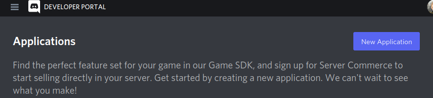
-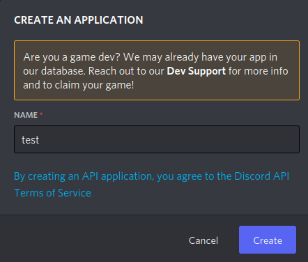

- Under the application create a new bot
- 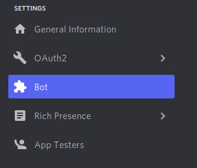
- 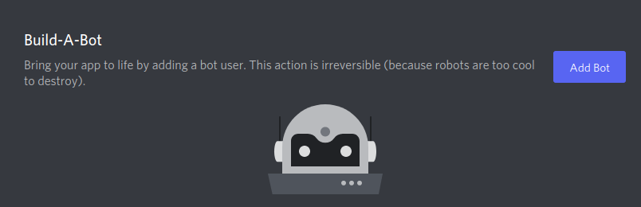
- 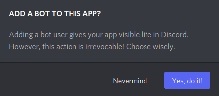

- Under the bot tab, regenerate then copy the token
- 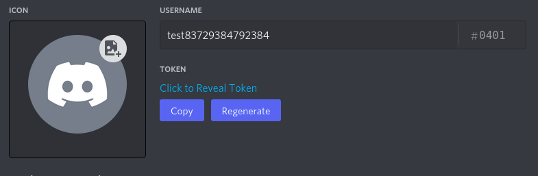
- 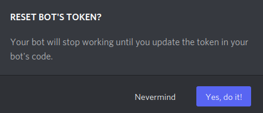

- Past the token into the .env file inside the source code I have provided, inside the quotes for the variable DISCORD_TOKEN
- 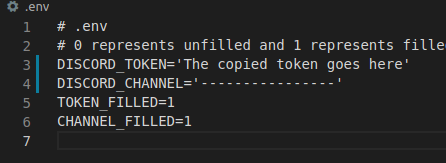

- save the bot ID for later
- 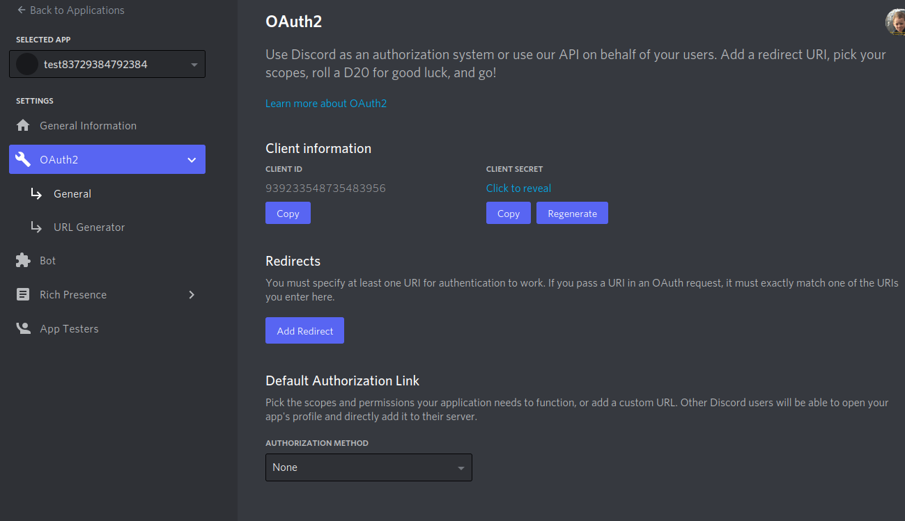
- 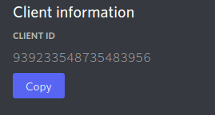


- Next, Login to either **[Discord.com](https://discord.com/)** or the Discord application

- Create a new server and name it
- 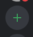
- 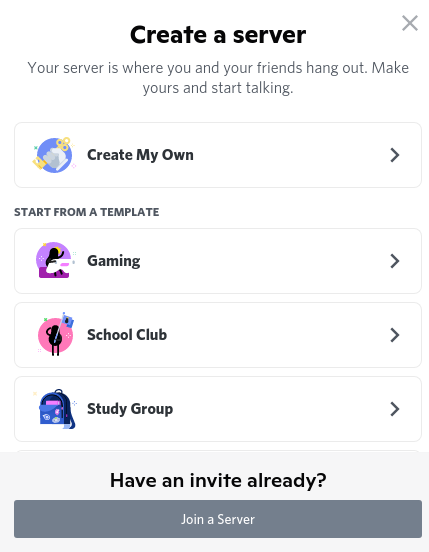
- 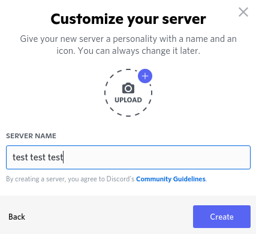
- 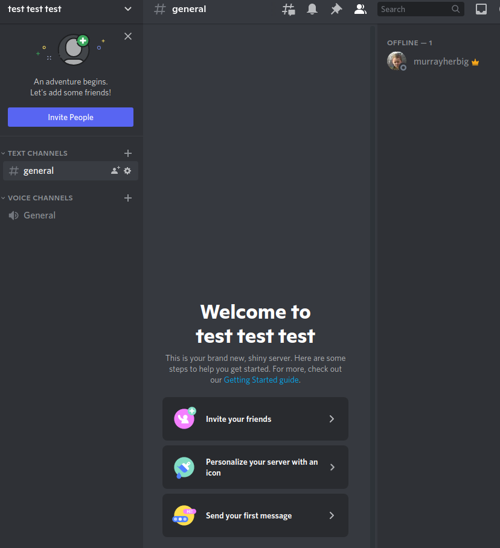


- past the follwing link into your browser "https://discord.com/oauth2/authorize?client_id=-------------------&scope=bot&permissions=8" but replace the dashes with the bot ID you saved earlier.
- 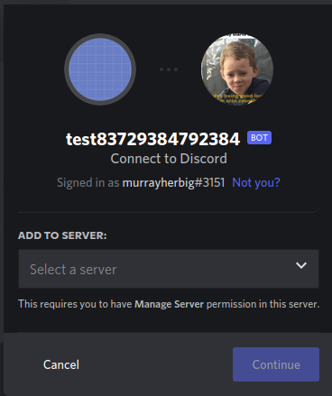

- select the server you want to add your bot to
- 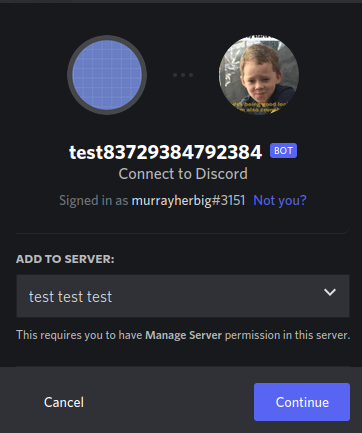
- 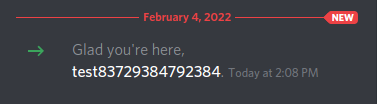

- go to the Discord app or website, navigate into the server you added the bot to, right click on the channel you want the bot to be active and select edit channel, then select permissions and turn the channel to a private channel
- 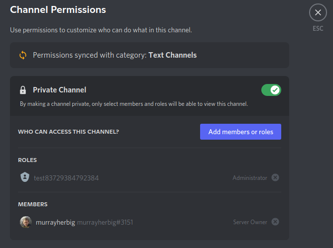
- 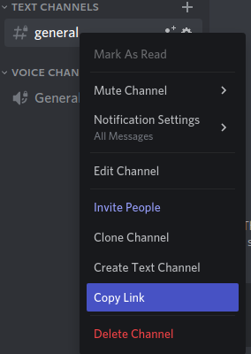
- 
- 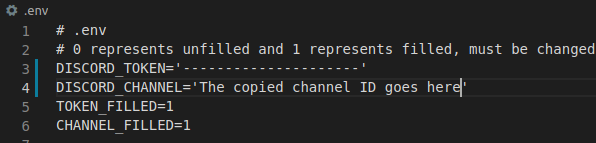
- 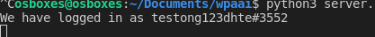


-Right click on the channel you want one more time, select copy link. Just use the the last integer of the link, copy it  and paste it into the .env file inside the quatoations for the variable DISCORD_CHANNEL


- Save everything. You are now ready to run the code.


- You can either use an IDE (I recomend PyCharm or VS Code), or terminal to run the code.

# **To Run**
***Via Terminal***
Navigate into the 
```
python server.py
```
OR
```
python3 server.py
```

- If it is working correctly and you have put in the correct values for the DISCORD_TOKEN and DISCORD_CHANNEL, 
as well switching TOKEN_FILLED & CHANNEL_FILLED to 0, in the terminal it should say "We have logged in as 'name of your bot'"
and you should receive a message in your server.
- 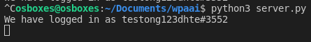


